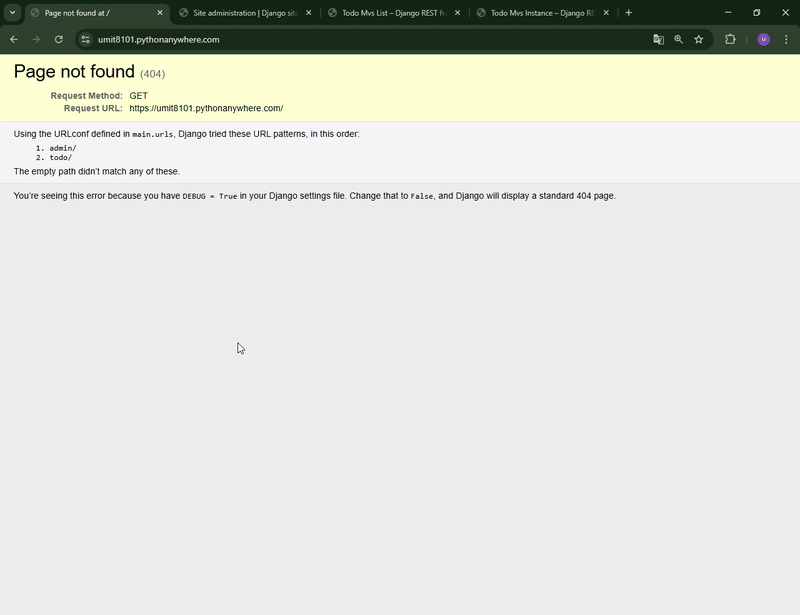

<p align="center">
  
  
  
</p>

<h1 align="center">✅ Todo REST API</h1>

<p align="center"><strong>A lightweight, efficient, and user-friendly task management system built with Django REST Framework 🚀</strong></p>


<div align="center">
  <h3>
    <a href="https://umit8101.pythonanywhere.com/">
      🖥️ Live Demo (Browsable API)
    </a>
     | 
    <a href="https://github.com/umitarat-dev/todo-rest-api">
      📂 Repository
    </a>
  </h3>
</div>

<p align="center">
  <a href="https://umit8101.pythonanywhere.com/todo/">
    
  </a>
</p>

## 📚 Navigation
- [🚀 Live API Access](#-live-api-access)
- [📦 Key Features](#-key-features)
- [🛠️ Built With](#️-built-with)
- [⚙️ Setup & Installation](#️-setup--installation)
- [📬 Contact Information](#-contact-information)

## 🚀 Live API Access
The API utilizes the **Django Browsable API** for a clean, interactive testing experience directly from your browser.
* **API Root:** [https://umit8101.pythonanywhere.com/todo/](https://umit8101.pythonanywhere.com/todo/)
* **Postman Collection:** [Explore in Postman](https://umit-dev.postman.co/workspace/Team-Workspace~7e9925db-bf34-4ab9-802e-6deb333b7a46/collection/17531143-2f319feb-d1dd-4e25-8774-b3f1f5589e7d)

> **Note:** For quick testing, you can use the web-based interface to perform GET, POST, and DELETE operations without any additional tools.

## 📦 Key Features
* **Full CRUD Operations:** Seamlessly create, read, update, and delete tasks.
* **Priority-Based Organization:** Assign and track tasks based on urgency levels.
* **Clean Web Interface:** Leverages DRF's Browsable API for instant manual testing.
* **Optimized for Simplicity:** Lightweight architecture designed for high performance and clarity.
* **Status Tracking:** Quick visibility into task completion and descriptions.


## 🛠️ Built With
* **Framework:** [Django 5.2](https://www.djangoproject.com/)
* **API Engine:** [Django REST Framework](https://www.django-rest-framework.org/)
* **Database:** SQLite (Ideal for lightweight task management)
* **Testing Tools:** Postman & DRF Browsable API
  

## ⚙️ Setup & Installation

### Local Development

#### 1. Clone & Environment:
```bash
git clone [https://github.com/umitarat-dev/todo-rest-api.git](https://github.com/umitarat-dev/todo-rest-api.git)
cd todo-rest-api
python3 -m venv env
source env/bin/activate  # macOS/Linux
# env\Scripts\activate  # Windows
```

#### 2. Configuration:
Create a .env file in the root:
```bash
SECRET_KEY=your_secure_secret_key
DEBUG=True
```


#### 3. Install & Run:
```bash
pip install -r requirements.txt
python3 manage.py migrate
python3 manage.py runserver
```

Example API Request (JSON)
To create a new task via POST to /todo/:

```JSON
{
  "task": "Refactor README",
  "description": "Align Todo API README with Personnel API format",
  "priority": 1
}
```


## 📬 Contact Information

I am always open to discussing new projects, creative ideas, or opportunities to be part of your visions.

* **LinkedIn:** [linkedin.com/in/umit-arat](https://www.linkedin.com/in/umit-arat/)
* **Email:** [umitarat8098@gmail.com](mailto:umitarat8098@gmail.com)
* **GitHub:** [github.com/umitarat-dev](https://github.com/umitarat-dev) (Current Workspace)